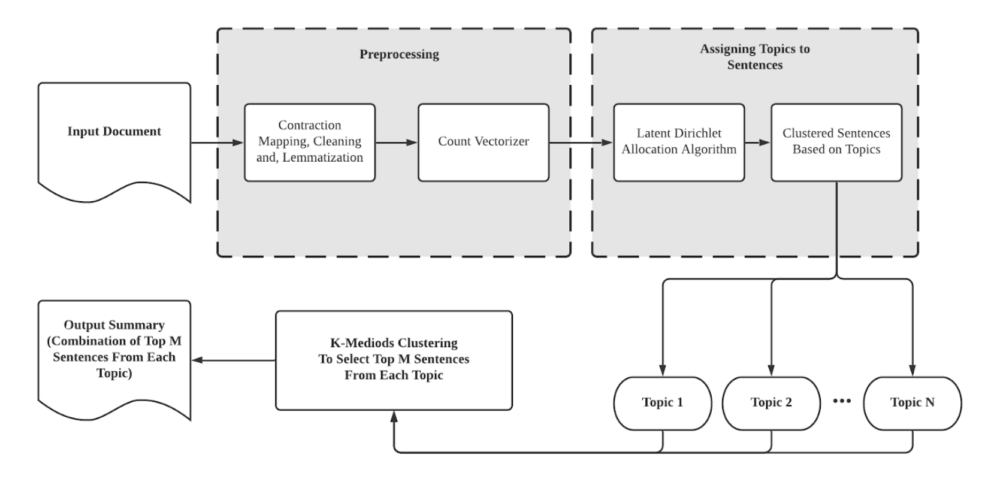
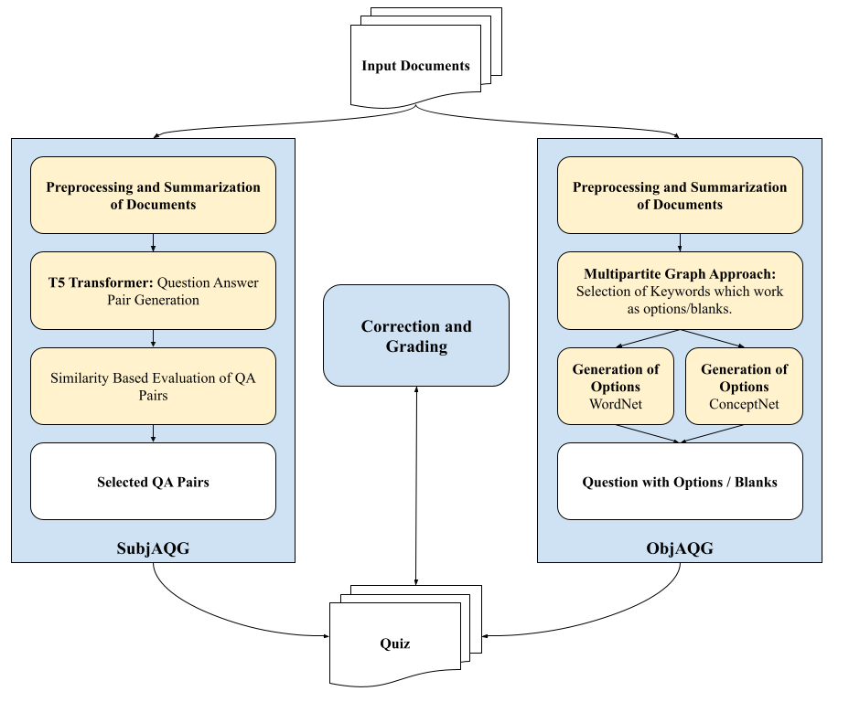
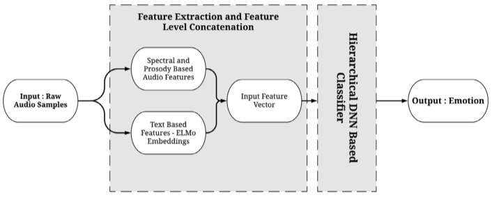

Following are the areas that I am working on:

Text Summarization
------
*Organization* - Netaji Subhas University of Technology
*Collegues* - Ridam Srivastava
*Current State* - In progress. Targeted Publication - Expert Systems (Elsevier)

My latest interest includes developing a SOTA extractive text summarization method that focuses on subtopic awareness to improve quality of the summary. Human written summaries
aim to extract each area covered in a document using a few lines at the most. In a similar manner, our work leverages a variation of LDA in conjugation with K-Medoids Clustering to extract summaries from two datasets.

AQG Systems
------
*Organization* - D.Kraft Singapore & IIIT Delhi
*Collegues* - Prof. Debarka Sengupta
*Current State* - In progress for publication and patent

In today’s post COVID scenario, it has become imperative to develop smart e-learning solutions to manage distance learning in large institutions. While multiple solutions have been presented to manage these education platforms and to connect the educator to the student, there remains a dearth of systems which can manage the automatic generation and correction of quizzes and assessments. The few existing systems are restrictive in their domain areas and do not exploit the full benefit of modern AI technologies. In this work, we present a solution to this problem by proposing a novel end-to-end approach for quiz generation and correction powered by a bi-modular deep learning based framework. The proposed system can generate and correct both subjective and objective questions thus easing the workload on an instructor. For objective questions, the system allows for absolute correction grading while for subjective questions, it proposed multiple answers to reduce bias towards a single answer. The proposed system is tested on multiple domain areas and robust performance is observed. We also propose certain use cases of the system.

<!-- Automatic QA Systems
------ -->

Previous Work
======

Speech Emotion Recognition
------
*Organization* - Netaji Subhas University of Technology
*Collegues* - Ridam Srivastava
*Current State* - [Published](https://www.sciencedirect.com/science/article/abs/pii/S0950705121005785)

Speech emotion recognition (SER) plays a crucial role in improving the quality of man–machine interfaces in various fields like distance learning, medical science, virtual assistants, and automated customer services. A deep learning-based hierarchical approach is proposed for both unimodal and multimodal SER systems in this work. Of these, the audio-based unimodal system proposes using a combination of 33 features, which include prosody, spectral, and voice quality-based audio features. Further, for the multimodal system, both the above-mentioned audio features and additional textual features are used. Embeddings from Language Models v2 (ELMo v2) is implemented to extract word and character embeddings which helped to capture the context-dependent aspects of emotion in text. The proposed models’ performances are evaluated on two audio-only unimodal datasets – SAVEE and RAVDESS, and one audio-text multimodal dataset – IEMOCAP. The proposed hierarchical models offered SER accuracies of 81.2%, 81.7%, and 74.5% on the RAVDESS, SAVEE, and IEMOCAP datasets, respectively. Further, these results are also benchmarked against recently reported techniques, and the reported performances are found to be superior. Therefore, based on the presented investigations, it is concluded that the application of a deep learning-based network in a hierarchical manner significantly improves SER over generic unimodal and multimodal systems.

<!-- Brain MRI Segmentation
------

TTR Estimation in Infants
------

COVID-19 Scenario in USA and India - A Topic Modelled Approach
------ -->

